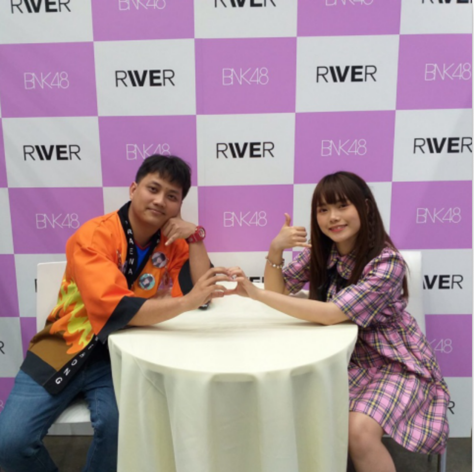

This repository contents IMI metering fraud project.

  

Blue:  year *2016* 

Red: year *2017* 

Orange: year *2018* 

Green: year *2019* 

Phase 1:
 * N3

Contributions:
  * cleansing measurement data from UCUE as seen in dict_measurement_N3.json

Group members:

  

    
    
    
    
    
    
    
    
    
    
    
  

